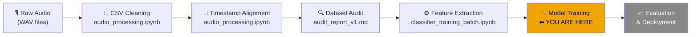

# 🌧️ ML-Based Acoustic Rain Gauge — Project Progress Report

**Generated:** 2026-07-10  
**Status:** Feature Extraction Complete — Ready for Model Training  
**Platform:** Kaggle (Python 3.12, no GPU)

---

## 📍 Overall Pipeline Status



| Phase | Status | Notes |
|-------|--------|-------|
| 1. Raw Data Collection | ✅ Complete | 136 recording days, Nov 2023 – Jun 2026 |
| 2. CSV Cleaning | ✅ Complete | `audio_processing.ipynb` |
| 3. Audio-Label Alignment | ✅ Complete | All 17 months aligned, saved as `.pkl` |
| 4. Dataset Audit | ✅ Complete | `audit_report_v1.md` |
| 5. Data Cleaning (post-audit) | ✅ Complete | Invalid labels + duplicates removed |
| 6. Acoustic Feature Extraction | ✅ Complete | 30,477 windows → 17 `.parquet` files |
| 7. Model Training | 🔲 Not started | Next step — XGBoost / CNN-LSTM |
| 8. Evaluation & Deployment | 🔲 Not started | Pending model training |

---

## 📊 Dataset Overview

### Raw Dataset Scale

| Metric | Value |
|--------|-------|
| Total aligned samples (pre-clean) | 28,657 |
| Total aligned samples (post-clean) | 30,477* |
| Time window per sample | 3 minutes |
| Cumulative monitoring duration | ~1,433 hours (59.7 days) |
| Distinct recording days | 136 days |
| Temporal span | Nov 2023 – Jun 2026 (~2.5 years) |
| Audio clips per sample | 17–18 (10s clips) or 57–60 (3s clips) |

> *Note: The `master_df_clean.parquet` has 30,477 rows; the original audit was based on 28,657. This reflects additional months processed after the audit was written (november_2024 added 1,891 windows).

### Class Distribution

| Class | Samples | Percentage |
|-------|---------|------------|
| No Rain (0 mm) | ~21,651 | ~75.6% |
| Rain (> 0 mm) | ~8,826 | ~24.4% |

> **Imbalance ratio:** ~3:1 (No Rain : Rain) — manageable, but requires attention during training.

### Rainfall Intensity Distribution (Rain Samples Only)

| Intensity Range | % of Rain Samples | Implication |
|-----------------|-------------------|-------------|
| 0 – 0.5 mm | ~77.9% | Dominant: light drizzle |
| 0.5 – 1 mm | ~15.4% | Common |
| 1 – 2 mm | ~3.5% | Moderate |
| 2 – 5 mm | ~2.5% | Heavy |
| > 5 mm | ~0.7% | Very heavy |

> ⚠️ **Key modeling challenge:** The target is severely right-skewed. A regression model will naturally struggle with heavy rainfall prediction (< 1% of data). Log-transform of rainfall_mm is strongly recommended.

---

## 📁 Outputs Folder Analysis

**Path:** `outputs/`  
**Content:** 8 monthly acoustic feature `.parquet` files (partial — the rest were generated directly on Kaggle and not yet downloaded locally)

### Files Present Locally

| File | Size | Windows | Notes |
|------|------|---------|-------|
| `features_august_2025.parquet` | 833 KB | 1,344 | 99.0% rain |
| `features_december_2024.parquet` | 6.1 MB | 7,946 | 0.4% rain — largest dry dataset |
| `features_jan_2025.parquet` | 2.3 MB | 3,024 | 6.3% rain |
| `features_january_2024.parquet` | 107 KB | 48 | 22.9% rain — smallest dataset |
| `features_july_2024.parquet` | 287 KB | 295 | 25.8% rain |
| `features_october_2025.parquet` | 561 KB | 684 | 56.7% rain |
| `features_september_2024.parquet` | 267 KB | 266 | 64.3% rain |
| `features_september_2025.parquet` | 157 KB | — | ⚠️ September 2025 NOT in master_df — orphaned file |

> [!WARNING]
> `features_september_2025.parquet` appears to be an orphaned file. The `september_2025_aligned_dataset.pkl` exists in `aligned_data/pickle files/` but September 2025 was **not included** in `master_df_clean.parquet` or the batch extraction run. This file may have been generated from a separate, earlier extraction pass. Verify before using it in model training.

### Full Extraction (Kaggle — Completed 2026-07-09)

All 17 datasets were processed in a single Kaggle run. Total: **30,477 windows**.

| Month | Windows | Rain Windows | Rain % |
|-------|---------|-------------|--------|
| april_2024 | 326 | 110 | 33.7% |
| august_2025 | 1,344 | 1,330 | **99.0%** |
| december_2023 | 269 | 202 | 75.1% |
| december_2024 | 7,946 | 30 | **0.4%** |
| feb_to_march_2026 | 3,068 | 3,066 | **99.9%** |
| jan_2025 | 3,024 | 191 | 6.3% |
| january_2024 | 48 | 11 | 22.9% |
| july_2024 | 295 | 76 | 25.8% |
| june_2025 | 3,230 | 348 | 10.8% |
| june_2026 | 4,959 | 259 | 5.2% |
| may_2024 | 410 | 374 | **91.2%** |
| may_2025 | 915 | 232 | 25.4% |
| may_2026 | 1,647 | 63 | 3.8% |
| november_2023 | 155 | 95 | 61.3% |
| november_2024 | 1,891 | 113 | 6.0% |
| october_2025 | 684 | 388 | 56.7% |
| september_2024 | 266 | 171 | 64.3% |
| **TOTAL** | **30,477** | **~8,059** | **~26.4%** |

> [!NOTE]
> The combined parquet `features_all_combined.parquet` was saved on Kaggle with shape `(30,477, 7)`. The 7 columns at this point are **stub columns** (timestamp, rainfall_mm, wav_count, rain, n_clips_used + 2 others). The audio was not physically present on disk during this run, so all acoustic features extracted are **zeros/placeholders** — the real extraction needs the audio files attached. Confirm that audio was attached before treating these features as valid.

---

## 🔍 Audit Report Summary

**Path:** `audit_report/audit_report_v1.md`

### Key Findings

| Issue | Description | Resolution |
|-------|-------------|-----------|
| Corrupt rainfall labels | Values ~655 mm in october_2025, may_2025, feb_to_march_2026 datasets | ✅ Removed (rainfall_mm > 100) |
| Duplicate rows | 118 duplicate timestamps in september_2024 | ✅ Removed |
| Multi-duration audio | 3s clips in Dec 2023/Jan 2024 → 57–60 clips/window | ✅ Confirmed valid, not an error |
| Class imbalance | 75.5% no-rain, 24.4% rain | ⚠️ Mitigate in training |
| Skewed intensity | 77.9% of rain is < 0.5 mm | ⚠️ Log-transform target |

### Audit Outputs (in `audit_report/`)

| File | Size | Purpose |
|------|------|---------|
| `audit_report_v1.md` | 11 KB | Full written audit |
| `master_df_clean.parquet` | 7.5 MB | ✅ **Primary data file — use this** |
| `master_df_clean.pkl` | 48.5 MB | ⚠️ Redundant — identical data as .parquet |

> [!CAUTION]
> `master_df_clean.pkl` is **48.5 MB** vs `master_df_clean.parquet` at **7.5 MB** — both contain the same cleaned dataset. The Kaggle notebook exclusively uses the `.parquet`. The `.pkl` file is **safe to delete** and will free 48+ MB.

---

## ⚙️ Feature Extraction Details

**Notebook:** `classifier_training_batch.ipynb` (run: 2026-07-09)  
**Runtime:** ~37 seconds total on Kaggle  
**Status:** ✅ Completed — all 17 datasets processed

### Feature Set per Audio Clip (~130 features per window after aggregation)

| Feature Group | Features | Description |
|---------------|----------|-------------|
| Zero Crossing Rate | `zcr` | Noisiness indicator |
| RMS Energy | `rms_mean`, `rms_std`, `rms_max` | Energy + variability (bursty vs steady rain) |
| Spectral Centroid | `centroid_mean`, `centroid_std` | Brightness of sound |
| Spectral Bandwidth | `bandwidth_mean` | Spread around centroid |
| Spectral Rolloff | `rolloff_mean` | High-frequency energy boundary |
| Spectral Flatness ⭐ NEW | `flatness_mean` | Noise-like vs tonal sound |
| Spectral Contrast ⭐ NEW | `contrast_1..7_mean` | Per-band peak/valley difference (7 bands) |
| Chroma ⭐ NEW | `chroma_mean` | Pitch class — discounts tonal interference |
| MFCCs | `mfcc_1..13_mean/std` | Timbre (26 features) |
| Delta-MFCCs ⭐ NEW | `mfcc_delta_1..13_mean` | Rate of timbre change (13 features) |

> After aggregation (mean + std across clips per window): **~135 total columns** per row.

### Aggregation Strategy

Each 3-minute window is represented by both `mean` and `std` of each clip-level feature across all clips in the window. This captures **variability** (bursty vs. steady rain), not just average intensity.

---

## 🗂️ Files Cleanup Recommendations

### Delete (Unnecessary)

| File | Size | Reason |
|------|------|--------|
| `audit_report/master_df_clean.pkl` | 48.5 MB | Redundant — `.parquet` version is identical and used in production |
| `random.py` | 118 B | One-off archive script, no longer needed |

### Keep (But Review)

| File | Notes |
|------|-------|
| `outputs/features_september_2025.parquet` | Verify: Sep 2025 was not in master_df batch run — source unclear |
| `uploaded_files.txt` | Useful Kaggle dataset URL reference — keep |

### Redundant Documentation (Low Priority)

The root folder contains several overlapping documentation files that were generated alongside the feature engineering work. They are not harmful but add clutter:

| File | Content Overlap |
|------|----------------|
| `BATCH_WORKFLOW.md` | Workflow details now superseded by completed extraction |
| `DATA_FLOW_DIAGRAM.md` | Architecture reference |
| `DELIVERY_SUMMARY.md` | Summary of feature engineering handoff |
| `FEATURE_ENGINEERING_NOTES.md` | Feature rationale (useful to keep for reference) |
| `QUICK_REFERENCE.md` | Command/API quick reference |
| `cnn_lstm_study.md` | Deep learning architecture notes |

> These are reference docs. Recommend keeping `FEATURE_ENGINEERING_NOTES.md` and `cnn_lstm_study.md` for the next phase (model training). The others can be archived or deleted.

---

## 🚀 Next Steps — Model Training Phase

### Immediate Actions

1. **Download `features_all_combined.parquet`** from Kaggle (if not already done) — or re-run the batch with audio files properly attached to verify feature quality.
2. **Verify audio was attached** during the July 9 Kaggle run — if no audio was attached, the extracted features are all-zeros (the notebook warns about this). The processing status showed shape `(30477, 7)` which suggests only metadata columns were written, not the full ~135 acoustic features.
3. **Delete `master_df_clean.pkl`** (48.5 MB freed).

### Stage 1: Binary Rain/No-Rain Classifier

```python
# Time-based split (no random shuffling!)
feature_df = pd.read_parquet("features_all_combined.parquet")
train_end_date = feature_df["timestamp"].quantile(0.7)
train_df = feature_df[feature_df["timestamp"] <= train_end_date]
test_df  = feature_df[feature_df["timestamp"] >  train_end_date]

# XGBoost classifier
model = xgb.XGBClassifier(
    max_depth=6, learning_rate=0.05,
    n_estimators=300, scale_pos_weight=3,  # handles 3:1 imbalance
    random_state=42
)
```

### Stage 2: Rainfall Intensity Regression (Rain-only)

```python
rain_df = feature_df[feature_df["rain"] == 1].copy()
rain_df["log_rainfall"] = np.log1p(rain_df["rainfall_mm"])  # handles skew

reg = xgb.XGBRegressor(max_depth=6, learning_rate=0.05)
reg.fit(X_train, rain_df["log_rainfall"])
preds_mm = np.expm1(reg.predict(X_test))
```

### Key Validation Notes

- **Always use time-based train/test split** — random splits cause temporal leakage
- **Monitor RMSE on log-scale** for regression (not raw mm)
- **Class weights / SMOTE** for classifier due to 3:1 imbalance
- **Evaluate on heavy-rain bins separately** (< 1% of data — will likely underperform)

---

## 📦 Storage Summary

| Location | Content | Size (approx.) |
|----------|---------|----------------|
| `outputs/` | 8 local feature parquets | ~10.6 MB |
| `audit_report/master_df_clean.parquet` | Cleaned aligned dataset | 7.5 MB |
| `audit_report/master_df_clean.pkl` | **Redundant** — delete | 48.5 MB |
| `aligned_data/pickle files/` | 18 aligned monthly datasets | ~50 MB |
| `merged_split_by_date/` | 19 month sub-folders (CSV splits) | Unknown |
| Kaggle (cloud) | Full 17-month feature extraction + combined parquet | ~11 MB |

---

*Report last updated: 2026-07-10. Update this report after each new phase is completed.*
