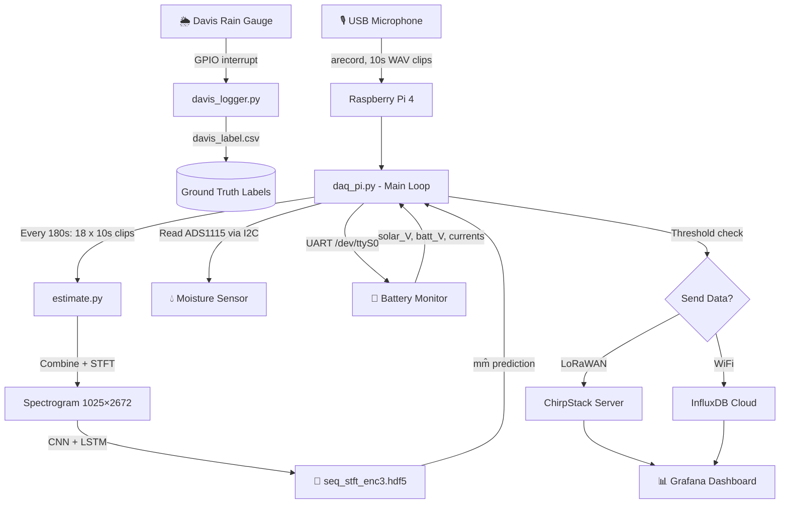

# 🌧️ ML-Based Acoustic Rain Gauge — Project Analysis

## Project Overview

This is an **IoT + Machine Learning** field instrument that estimates rainfall by **listening to rain sounds** through a microphone attached to a Raspberry Pi. Instead of a traditional tipping-bucket mechanism, it uses audio + deep learning to estimate precipitation in millimetres. A Davis mechanical rain gauge runs in parallel to generate ground-truth labels for model training.

---

## Repository Structure

```
src/
├── daq_pi.py                  ← Main entry point (Data Acquisition on Pi)
├── davis_logger.py            ← Mechanical rain gauge ground-truth logger
├── requirements.txt
├── setup.sh                   ← Raspberry Pi system setup script
│
├── config/
│   └── config.yaml            ← Central configuration file
│
├── plugins/
│   ├── battery_monitor.py     ← Solar + battery telemetry via UART
│   ├── moisture_sensor.py     ← Soil moisture sensor via I2C/ADS1115
│   └── rain_sensor.py         ← Simple digital rain detection via GPIO
│
├── utils/
│   ├── estimate.py            ← Model inference (STFT → CNN+LSTM → mm)
│   ├── connectivity.py        ← Data upload via WiFi (InfluxDB) or LoRaWAN
│   └── helper.py              ← YAML loader, folder management, filename utils
│
├── ML pipeline/
│   ├── data_preprocessing.py  ← Dataset curation and balancing script
│   ├── data_postprocessing.ipynb ← Post-inference analysis notebook
│   └── model_training_& validation.ipynb ← Model training notebook
│
├── lmic_rpi/                  ← LoRaWAN library for Raspberry Pi
└── test/
    ├── inferencing.py         ← Offline batch inferencing script
    ├── lora_ping.py           ← LoRa connectivity test
    ├── find_interval_diff.py  ← Timestamp gap analysis utility
    └── test_unit.py           ← Unit tests
```

---

## System Architecture



---

## daq_pi.py — Detailed Walkthrough

### Imports & Dependencies
| Import | Purpose |
|---|---|
| `RPi.GPIO` | GPIO access on Raspberry Pi |
| `subprocess` / `arecord` | Shell-level audio recording (ALSA) |
| `librosa` | Audio loading + STFT computation |
| `keras` | CNN + LSTM model inference |
| `influxdb_client` | Time-series DB for cloud upload |
| `Adafruit_ADS1x15` | I2C ADC for moisture sensor |
| `serial` | UART for battery monitor MCU |

---

### `main()` — Step-by-Step Execution

**Phase 0 — Initialization**
```python
config = load_config("config.yaml")          # Load all settings
infer_model = load_estimate_model(path)      # Build CNN+LSTM, load weights
ser = setup_serial_connection(uart_port)     # Open UART to battery MCU
```

**Phase 1 — Audio Recording Loop**

Two modes controlled by `field_deployed` in config:

| Mode | `field_deployed: true` | `field_deployed: false` |
|---|---|---|
| Loop type | `while True` (infinite) | `for i in range(...)` (bounded by `record_hours`) |
| Logging | `print()` only | File logger (`audio_recording_log.txt`) |
| CSV output | None | `estimated_rainfall.csv` written each cycle |
| Use case | Production deployment | Lab/indoor data collection |

**Each iteration:**
1. `record_audio()` → calls `arecord` for `sample_duration_sec=10` seconds, saves `.wav` timestamped file to `/home/pi/raingauge/data/`
2. `locations.append(location)` — accumulates file paths

**Phase 2 — Inference (every `num_subsamples = 180//10 = 18` clips)**
```python
if i % num_subsamples == 0:
    mm_hat = estimate_rainfall(infer_model, locations)  # Run ML model
    delete_files(files_to_delete)                        # Clean up WAVs
    locations.clear()
    rain += mm_hat                                       # Accumulate rain
    db_counter += 1
```

**Phase 3 — Sensor Reads**
```python
moisture = read_moisture_sensor(channel=0, gain=1)           # ADS1115 ADC
solar_V, battery_V, solar_I, battery_I = preprocess_dataframe(ser)  # UART
```

**Phase 4 — Conditional Data Upload (every `DB_writing_interval_min` cycles)**
```python
if db_counter == DB_write_interval:
    if moisture < moisture_threshold AND rain >= min_threshold:
        send_data(config, mm_hat, ...)   # Real rain → send actual value
    else:
        send_data(config, 0.0, ...)      # Dry / false positive → send 0
    rain, db_counter = 0, 0
```

> **Smart filtering:** The moisture sensor cross-validates the acoustic estimate. If soil is dry AND rain is below `min_threshold=0.6mm`, the reading is suppressed as noise.

---

### Key Configuration Parameters (`config.yaml`)

| Parameter | Value | Meaning |
|---|---|---|
| `sample_duration_sec` | 10 | Length of each WAV clip |
| `infer_interval_sec` | 180 | One ML prediction every 3 minutes |
| `num_subsamples` | 18 | `180 / 10 = 18` clips per inference |
| `seq_len` | 1,368,000 | Max audio samples fed to model |
| `sampling_rate` | 8000 Hz | Audio sample rate |
| `stft_shape` | `[None,1,1025,2672]` | Expected spectrogram shape |
| `min_threshold` | 0.6 mm | Minimum rainfall to report |
| `moisture_threshold` | 16000 | ADC units for wet soil |
| `DB_writing_interval_min` | 1 | Upload every 3-min inference cycle |
| `communication` | LORAWAN / WIFI | Backend transport |
| `record_hours` | 168 | 7-day continuous recording |

---

## ML Pipeline — End to End

### Stage 1: Data Collection (Hardware)

Two parallel processes run simultaneously on the deployed Pi:

| Process | Script | Data Produced |
|---|---|---|
| Acoustic | `daq_pi.py` | 10-second WAV files, timestamped |
| Ground Truth | `davis_logger.py` | `davis_label.csv` (timestamp, mm) every 3 min |

`davis_logger.py` uses a **GPIO interrupt** on the Davis tipping-bucket pin. Each bucket tip = 0.2 mm. It counts tips in a 3-minute window and logs `(timestamp, rainfall_mm)` to CSV and InfluxDB.

---

### Stage 2: Data Preprocessing (`data_preprocessing.py`)

This offline script curates the raw dataset before training:

```
Raw WAVs + davis_label.csv
        │
        ▼
1. Time-align: Find all WAVs within 3-min window of each label
2. Quality filter: Discard labels with < 17 matching audio files
3. Class balance: Keep ALL non-zero rain rows
                  Randomly sample 20% of zero-rain rows
4. False-data filter: Remove 0.2mm readings between 05:55–06:05
                      (mechanical gauge auto-resets at midnight, causes spurious tips)
5. Sort by timestamp
        │
        ▼
Output: filtered_rain.csv + organized /wav folder
```

**Why 20% zero-rain sampling?**
Rain events are rare — dataset is heavily skewed toward silence. Keeping only 20% of zero-rain samples prevents the model from predicting 0 for everything.

**Why the 05:55–06:05 filter?**
The mechanical gauge resets at ~6 AM, causing a spurious 0.2 mm tip that isn't real rain. These are systematically removed.

---

### Stage 3: Model Training (`model_training_& validation.ipynb`)

**Input features:** Short-Time Fourier Transform (STFT) magnitude spectrogram
- 18 × 10-second WAV clips concatenated → 180-second audio window
- Clipped to `seq_len = 1,368,000` samples
- `librosa.stft()` → magnitude `|Z|` → shape `(1025, 2672)`

**Model Architecture: CNN + LSTM Regressor**

```
Input: (1025, 2672, 1)   ← STFT spectrogram as single-channel image
    │
    ├── Conv2D(64, 8×8, relu)
    ├── MaxPooling2D(8×8)          → spatial downsampling
    │
    ├── Conv2D(32, 4×4, relu)
    ├── MaxPooling2D(4×4)
    │
    ├── Conv2D(16, 2×2, relu)
    ├── MaxPooling2D(2×2)          → feature map ~(7, 20, 16) ≈ 2240 units
    │
    ├── Reshape((1, -1))           → sequence of length 1 for LSTM
    ├── LSTM(20)                   → temporal context
    │
    ├── Dense(32, relu)
    ├── Dense(16, relu)
    └── Dense(1)                   ← Output: rainfall in mm (regression)
```

**Why LSTM on top of CNN?**
The LSTM adds sequential memory even though the temporal dimension is collapsed by Reshape. In practice it acts as a learned non-linear bottleneck before the Dense regression head.

**Loss function:** MSE (regression), trained to predict continuous mm values  
**Saved model:** `seq_stft_enc3.hdf5` (weights only, architecture rebuilt in code)

---

### Stage 4: Inference (`utils/estimate.py`)

```python
def estimate_rainfall(model, file_paths):
    audio = combine_audios(file_paths)   # Load + concatenate 18 WAVs
    audio = audio[:seq_len]              # Clip to 171 seconds
    stft_sample = create_cnn_data(audio) # STFT → magnitude → add batch dim
    y_pred = model.predict(stft_sample)  # CNN+LSTM → scalar mm
    return y_pred
```

The STFT uses librosa defaults: window=2048, hop=512, giving shape `(1025, T)` where `T ≈ 2672` for 171 seconds at 8 kHz.

---

### Stage 5: Post-processing (`data_postprocessing.ipynb`)

Offline analysis after a field deployment:
- Compare acoustic estimates vs Davis mechanical readings
- Plot time-series, scatter plots, compute RMSE/correlation
- Identify failure modes (false positives in wind, insects, etc.)

---

## Connectivity Layer (`utils/connectivity.py`)

| Transport | Method | Details |
|---|---|---|
| **WiFi** | `send_data_via_internet()` | InfluxDB HTTP API — writes `acoustic raingauge` measurement with fields: `rain`, `solar voltage`, `battery voltage`, `solar current`, `battery current` |
| **LoRaWAN** | `send_data_via_lorawan()` | Calls `ttn-abp-send` CLI with ABP keys (dev_addr, nwk_skey, app_skey) — retries until success |

LoRaWAN is preferred for remote deployments with no WiFi. The `led_flag` in `lorawan_keys.yaml` can trigger an LED on the gateway to confirm uplink.

---

## Battery Monitoring (`plugins/battery_monitor.py`)

A separate MCU (e.g. Arduino) monitors the solar charge controller and sends data over UART using a simple framed protocol:

```
[start: 0x15] [solar_V] [batt_V] [solar_I] [batt_I] [end: 0x4B]
```

The Pi reads byte-by-byte, scans for the `21` (0x15) start marker, reads 4 values, then reads until the `75` (0x4B) end marker. Values are divided by 10.0 to get actual float readings.

---

## Davis Logger (`davis_logger.py`)

Runs **in parallel** with `daq_pi.py` as a separate process:
- Attaches GPIO interrupt to Davis tipping bucket reed switch (`davis_interrupt_pin: 13`)
- Increments `count` on every RISING edge (each tip = 0.2 mm)
- Every `davis_log_interval_sec=180` seconds, writes `count × 0.2` to CSV and InfluxDB
- Resets count after each log interval

> [!NOTE]
> The `count > 50` guard in `bucket_tipped()` resets count if it exceeds 50 (10 mm/3 min), preventing corruption from electrical noise or bounce.

---

## Key Design Decisions & Trade-offs

| Decision | Rationale |
|---|---|
| 10-second audio clips | Short enough for real-time, long enough to capture rain texture |
| STFT over raw waveform | Frequency domain reveals rain intensity in spectral energy patterns |
| 8000 Hz sampling rate | Captures rain acoustics (dominated by < 4 kHz) while minimizing storage |
| 20% zero-rain balancing | Prevents class imbalance without discarding all silence data |
| Moisture cross-validation | Reduces false positives when non-rain sounds (insects, wind) fool the model |
| WAV deletion after inference | Conserves SD card storage during long deployments |
| Retrying LoRa until success | Ensures no data loss in poor RF conditions |
